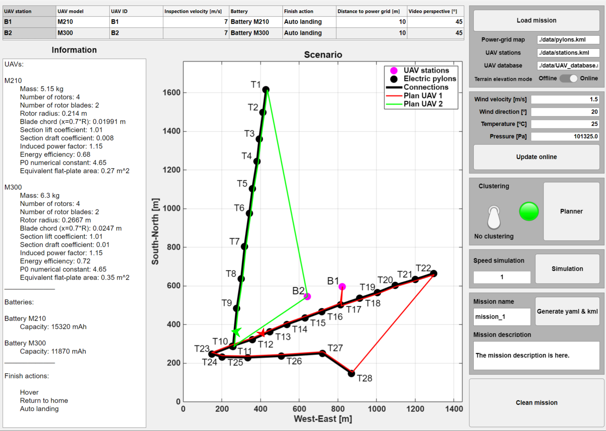

# Multi-UAV planner for power-line inspection

This repository includes a functional planner with UI for power-line inspections using heterogeneous multi-UAV teams.

## Citation

If you use this code or data in your research, please cite the associated paper:

Alvaro Caballero, Francisco Javier Roman-Escorza, Ivan Maza, and Anibal Ollero. **A Multi-UAV Approach for Fast Inspection of Overhead Power Lines: From Route Planning to Field Operation.** *Journal of Intelligent & Robotic Systems* 111, 67 (2025). https://doi.org/10.1007/s10846-025-02277-6

## Description
The main objective of this planner is to allow the user to obtain a mission to inspect power lines using a heterogeneous multi-UAV team. The planner focuses on minimizing the total mission time. 

Also, the UI allows the user to specify different mission settings. 



### UI options
 - Introduce different parameters that each UAV will need during the mission.
 - Import weather data from the internet or introduce it manually. 
 - Import terrain elevation data from the internet or use local data. 
 - Allow clustering on inspection of power segments. 
 - Simulate the mission at different velocities.
 - Save the mission as *.yaml and *.kml files.

### Use case
 - Inspect different segments of the power grid. 

### How to Install
Clone the repository to your computer: 

``` bash
git clone https://github.com/fraromesc/pli_planner
```

#### Requirements : 
 - Matlab R2023a or newer. 
 - [Optimization Toolbox](https://nl.mathworks.com/products/optimization.html)
 - [Image Processing Toolbox](https://nl.mathworks.com/products/image-processing.html) 
 
## Quick Start 
### Launch GUI
Run on Matlab's Command Window: 


``` Matlab
run gui_planner
```

### Load Map
It is necessary to complete all parameters in the box on the top right side to load the map. It requires:
 - Select if the elevation of the terrain will be adopted from [Open Topo Data](https://www.opentopodata.org/datasets/eudem/).
 - Paths of three files at the boxes:

    1. **Tower file:** This file defines the tower positions and how they are connected. It is a .kml file that can be created using [Google Earth Pro](https://www.google.com/intl/es/earth/about/versions/#earth-pro). It is recommended to follow the steps at this video for file generation:

        

    2. **Bases file:** This file defines the positions of the UAV bases. It is a .kml file that can be created using [Google Earth Pro](https://www.google.com/intl/es/earth/about/versions/#earth-pro). It is recommended to follow the steps at this video for file generation:

        

    3. **UAVs file:** This file defines the UAVs that will be used in the mission and the batteries they will use. The file '/files/UAVs_bat_data.m" is an example that may be used as a guide to create others. 

### Configure Mission Parameters

   1. In the table on the top part, select all parameters for each base:
        - The information about all available UAVs and batteries are at the box 'Information', in the left side.
        - The relative position of the UAV with respect to the power grid can be determined by defining two parameters:
            - 'Horizontal offset' and 'Inspection height'
            - 'Distance offset' and 'Gimbal angle' 
   2.  Update weather condition manually or using online data.

### Plan a Mission
Clicking on the button 'Planner', a mission will be planned to inspect all power-line segments using all available UAVs. In this use case, the clustering option can be enabled to plan a mission faster.

### Simulation
A simple simulation can be performed by using the button 'Simulation' to check the directions of the UAVs and the relative position with respect to the power grid. The simulation speed can be increased or decreased using the box 'Speed simulation'.

### Generate files
The resulting mission can be generated, saving it in the files .yaml (for the Ground Control Station) and .kml (for visualization on Google Earth Pro), after including a mission name and a brief description. The files will be generated in the main directory of the repository as 'mission_{Mission Name}.kml' and 'mission_{Mission Name}.yaml'. 
